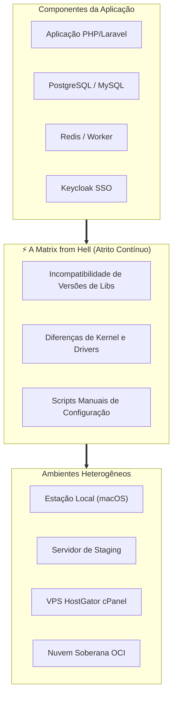
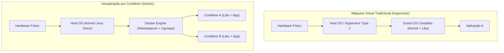

# 🔰 Aula 01: Fundamentos, Virtualização por Processos, Namespaces e Cgroups (Nível N0)

> [!tldr] Resumo Executivo (Totem da Aula)
> - **Conceito Central:** O Docker substitui a virtualização pesada por hypervisor por isolamento a nível de processos no kernel Linux, resolvendo a clássica "Matrix from Hell" através da tríade Linux: Namespaces (visibilidade), Cgroups (limites) e Union FS (camadas imutáveis).
> - **Por quê:** Entender o contêiner como um processo isolado no host desmistifica a tecnologia e ensina ao engenheiro que não há um sistema operacional separado rodando dentro dele, mas sim o mesmo kernel com fronteiras lógicas estritas.
> - **Aplicação no CTDOL:** Compreender que contêineres como `ssoctdol-keycloak-1` na VPS dividem o mesmo kernel do AlmaLinux, exigindo governança de recursos para que um serviço não comprometa a máquina inteira.

---

## ⚡ Glossário de Termos Rápidos (Flashcards — Regra 10.1)

- **Matrix from Hell:** Explosão combinatória de complexidade operacional decorrente da tentativa de instalar e manter $N$ componentes de software heterogêneos em $M$ servidores com configurações divergentes.
- **Hypervisor:** Camada de software ou firmware que emula hardware completo (BIOS, CPU virtual, placas de rede) para rodar múltiplos sistemas operacionais hóspedes (Guest OS) sobre um hardware físico.
- **LXC (Linux Containers):** Tecnologia pioneira do kernel Linux que permite a execução de múltiplos ambientes isolados compartilhando o mesmo kernel sem emulação de hardware.
- **Namespaces:** Primitiva do kernel Linux que particiona recursos globais do sistema operacional em caixas de visibilidade isoladas para grupos de processos (`pid`, `net`, `mnt`, `ipc`, `uts`, `user`).
- **PID Namespace:** Isolamento da árvore de identificadores de processos, permitindo que o processo principal dentro de um contêiner enxergue a si mesmo como `PID 1`.
- **Cgroups (Control Groups):** Recurso do kernel Linux que audita, restringe e limita a alocação de hardware físico (CPU, memória RAM, I/O de disco) por contêiner.
- **Union File System (Union FS):** Sistema de arquivos que mescla múltiplos diretórios em uma única visão lógica, empilhando camadas somente-leitura com uma camada de escrita temporária baseada em Copy-on-Write (CoW).
- **Copy-on-Write (CoW):** Estratégia de otimização de armazenamento em que um arquivo compartilhado de uma camada inferior só é duplicado na camada de escrita no momento exato em que sofre modificação.

---

## 🏗️ 1. O Problema Fundamental: A "Matrix from Hell"

Antes do advento dos contêineres padronizados, a equipe de engenharia enfrentava o seguinte dilema de compatibilidade:

O contêiner resolve essa matriz transformando o software e todas as suas dependências de biblioteca em um **artefato autocontido e imutável**.

---

## 🏛️ 2. Virtualização Tradicional vs Contêineres

| Critério | Máquina Virtual (VM) | Contêiner Docker |
| :--- | :--- | :--- |
| **Abstração** | Nível de Hardware (Hypervisor emula BIOS, CPU, Disco) | Nível de Sistema Operacional (Compartilha o Kernel Linux) |
| **Tempo de Boot** | Minutos (Carrega kernel e serviços systemd completos) | Milissegundos / Segundos ($O(1)$) |
| **Overhead de RAM** | Gigabytes dedicados exclusivamente para o Guest OS | Megabytes (Apenas o consumo real do processo) |
| **Desempenho I/O** | Penalizado pela camada de virtualização do hypervisor | Quase nativo (direto no host) |

---

## 🔬 3. O Tripé do Kernel Linux que Viabiliza o Docker

### A. Namespaces (Quem eu consigo enxergar?)
Cada contêiner recebe um conjunto exclusivo de namespaces criados na sua inicialização:
1. **`pid`**: O processo dentro do contêiner possui PID 1, mas no host possui um PID arbitrário (ex: 29482).
2. **`net`**: O contêiner possui sua própria interface `eth0`, tabela de rotas e firewall virtual.
3. **`mnt`**: A raiz `/` do contêiner é isolada do disco do host através de `pivot_root` e chroot moderno.
4. **`ipc`**: Filas de mensagens e memória compartilhada POSIX isoladas.
5. **`uts`**: Hostname próprio (ex: `hostname` retorna o container ID).
6. **`user`**: Mapeia o usuário `root` (UID 0) do contêiner para um usuário sem privilégios no host.

### B. Cgroups (Quanto eu posso consumir?)
Os Control Groups agrupam processos e limitam seu teto físico:
* `--memory 512m`: O contêiner só pode alocar 512 MB de RAM.
* `--cpu-shares 1024`: Define o peso relativo de uso de CPU durante picos de carga.

### C. Union File System (Como os arquivos são armazenados?)
As imagens do Docker não são um bloco rígido de disco, mas sim camadas empilhadas:
* Camada 1 (`ubuntu` base): 80 MB (Read-Only)
* Camada 2 (instalação do `nginx`): 30 MB (Read-Only)
* Camada 3 (código da aplicação): 5 MB (Read-Only)
* **Camada Superior (Container Layer):** Camada efêmera de escrita Read-Write criada no `docker run`. Ao remover o contêiner, apenas essa fina camada é destruída.

## 📚 Fundamentação Teórica na BIBLION

> [!info] Aprofundamento Epistêmico no Acervo (Erástos)
> A teoria de isolamento de processos e a história dos contêineres ensinadas nesta aula derivam formalmente do tratado de Daniel Romero destilado na BIBLIOTECA:
> - **Ficha Mestra da Obra:** Containers_com_Docker_Daniel_Romero
> - **Fundamentos, Virtualização, Namespaces e Cgroups (Cap. 1):** Fichamento_Containers_Docker_Cap01_Fundamentos_Namespaces_Cgroups
> - **Operação e Ciclo de Vida dos Contêineres (Cap. 2):** Fichamento_Containers_Docker_Cap02_Operacao_Ciclo_Vida_Containers
> - **Limites de Hardware (Cgroups), OOM e Orquestração (Cap. 7):** Fichamento_Containers_Docker_Cap07_Producao_Recursos_Orquestracao

---

## 🔗 Conexões & Grafo
- **MOC do Curso:** 00_MOC_Curso_Containers_Docker
- **Acervo Soberano:** 00_MOC_Acervo_Destilado
- **Curador Epistêmico:** ERASTOS
- **Trilha Pedagógica:** Trilha_Curso_Containers_Docker_Niveis
- **Próxima Aula:** Aula_02_Ciclo_de_Vida_Dockerfile_Camadas_Imutaveis_N1
- **Projeto Docker CTDOL:** 00_MOC_Docker_CTDOL
- **Tratado de Referência:** Containers_com_Docker_Daniel_Romero
