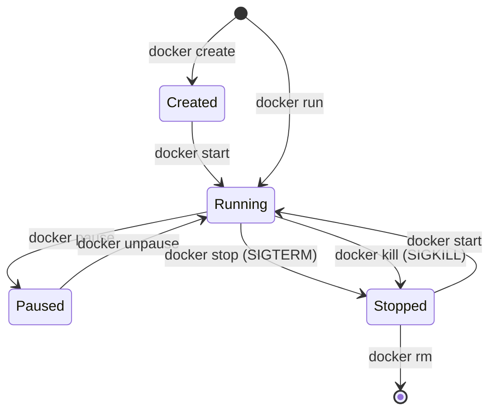

# 🐣 Aula 02: Ciclo de Vida do Contêiner, Sintaxe do Dockerfile e Camadas Imutáveis (Nível N1)

> [!tldr] Resumo Executivo (Totem da Aula)
> - **Conceito Central:** A construção de imagens padronizadas via `Dockerfile` materializa a Infraestrutura como Código (IaC), onde o encadeamento inteligente de comandos aproveita o cache de camadas do Union FS e a separação entre `CMD` e `ENTRYPOINT` garante a portabilidade do executável.
> - **Por quê:** Dockerfiles mal estruturados geram imagens inchadas (1+ GB), quebram caches de build e expõem a infraestrutura a comportamentos imprevisíveis ao executar comandos arbitrários no container start.
> - **Aplicação no CTDOL:** Seguir a ADR_001_infra-ctdol_Padrao_Deploy_Laravel e ADR_036_docker_Governanca_Imagens_Conteineres_Volumes, gerando imagens enxutas e pré-compiladas com proibição estrita da tag `:latest`.

---

## ⚡ Glossário de Termos Rápidos (Flashcards — Regra 10.1)

- **Dockerfile:** Arquivo declarativo em formato texto que reúne as instruções passo a passo para montar uma imagem Docker de forma automatizada e reproduzível.
- **Camada Imutável (Image Layer):** Cada instrução (`RUN`, `COPY`, `ADD`) no Dockerfile cria uma camada somente-leitura com o diff das alterações em relação à anterior, identificada por um hash SHA256.
- **Cache de Build:** Mecanismo do Docker que reutiliza camadas previamente construídas caso os comandos e arquivos do contexto não tenham sido alterados desde o último build.
- **Instrução WORKDIR:** Define o diretório de trabalho padrão dentro do contêiner para a execução de instruções subsequentes, eliminando o uso inseguro de múltiplos comandos `cd`.
- **Instrução COPY:** Copia arquivos e diretórios locais estáticos do contexto do host para o sistema de arquivos do contêiner.
- **Instrução ADD:** Semelhante ao COPY, mas com suporte embutido a download de URLs e descompactação automática de arquivos tar (`.tar.gz`).
- **Instrução CMD:** Define o comando padrão executado quando o contêiner inicia, facilmente substituível por parâmetros passados na CLI.
- **Instrução ENTRYPOINT:** Define o binário fixo que será o processo principal do contêiner, convertendo o contêiner em um executável autônomo.
- **Graceful Shutdown:** Encerramento controlado em que o Docker envia o sinal `SIGTERM` para o PID 1 e aguarda até 10 segundos para a finalização limpa de transações e conexões antes de forçar o `SIGKILL`.
- **BuildKit:** Motor de build padrão do Docker atual, que resolve o Dockerfile como um grafo de dependências concorrente — paralelizando estágios independentes e pulando os que não alimentam a saída final.
- **LLB (Low-Level Build):** Representação binária intermediária para a qual o Dockerfile é traduzido; grafo endereçado por conteúdo que o solver do BuildKit executa.
- **Multi-Stage Build:** Dockerfile com múltiplos `FROM`, em que estágios intermediários compilam o artefato e o estágio final copia apenas o resultado via `COPY --from`, descartando todo o toolchain.
- **Invalidação em Cascata:** Regra segundo a qual uma camada alterada invalida obrigatoriamente todas as camadas posteriores, mesmo que estas produzissem resultado idêntico.

---

## 🔄 1. O Ciclo de Vida Operacional do Contêiner



### Comandos Essenciais da CLI
```bash
# Execução interativa e descartável para testes rápidos
docker run --rm -it ubuntu:22.04 bash

# Execução em background com nome canônico e porta mapeada
docker run -d --name meu-nginx -p 8080:80 nginx:alpine

# Inspeção de metadados em JSON (IP, volumes, status)
docker inspect meu-nginx

# Streaming de logs da aplicação em tempo real
docker logs -f meu-nginx
```

---

## 🛠️ 2. Anatomia e Boas Práticas no Dockerfile

A ordem das instruções no `Dockerfile` determina diretamente a eficiência do build:

```dockerfile
# 1. Escolha de imagem base oficial e minimalista
FROM php:8.2-fpm-alpine

# 2. Metadados e rótulos de governança
LABEL maintainer="CTDOL DevOps <devops@ctdol.com.br>"

# 3. Variáveis de ambiente estáveis
ENV APP_ENV=production \
    PORT=80

# 4. Instalação de dependências do sistema em comando único (RUN chaining)
# Limpeza de cache de pacotes no mesmo comando para não inflar a camada!
RUN apk add --no-cache libpng-dev libzip-dev oniguruma-dev \
    && docker-php-ext-install pdo_mysql mbstring zip

# 5. Diretório de trabalho canônico
WORKDIR /var/www/html

# 6. Cópia de arquivos de dependência ANTES do código-fonte (Otimização de Cache)
COPY composer.json composer.lock ./

# 7. Cópia do código-fonte da aplicação
COPY . .

# 8. Documentação da porta interna
EXPOSE 80

# 9. Ponto de entrada fixo
ENTRYPOINT ["php-fpm"]
```

---

## ⚖️ 3. O Duelo Conceitual: `CMD` vs `ENTRYPOINT`

Compreender a diferença entre essas diretivas é o divisor de águas entre amadores e engenheiros sêniores de contêineres:

| Cenário | Diretiva | O que acontece se o usuário rodar: `docker run meu-app ping 8.8.8.8`? |
| :--- | :--- | :--- |
| **`CMD ["php", "artisan", "serve"]`** | `CMD` | O comando padrão é **completamente descartado** e o contêiner executa estritamente `ping 8.8.8.8`. |
| **`ENTRYPOINT ["php", "artisan"]`** | `ENTRYPOINT` | O comando passado é **apensado** ao entrypoint: o contêiner tentará rodar `php artisan ping 8.8.8.8`. |
| **`ENTRYPOINT` + `CMD` combinados** | Ambos | `ENTRYPOINT ["docker-entrypoint.sh"]`<br/>`CMD ["nginx", "-g", "daemon off;"]`<br/>O script atua como wrapper e recebe o `CMD` como argumento padrão. |

---

## 📜 4. Tratamento de Logs: o Contêiner Não Escreve em Arquivo

Um contêiner **não** deve gravar logs em arquivo dentro de si. A aplicação escreve em `stdout`/`stderr`, e o Docker Engine captura esse fluxo através do seu *logging driver*.

### Por que essa regra existe
- O sistema de arquivos do contêiner é **efêmero**: em um `docker rm`, o arquivo de log vai junto.
- Log gravado em camada de escrita **infla o contêiner** e penaliza o Copy-on-Write.
- Sem o fluxo padrão, `docker logs` fica mudo e nenhum agregador externo consegue coletar.

### O padrão canônico em imagens oficiais
Imagens oficiais aplicam o redirecionamento via link simbólico para os dispositivos padrão:

```dockerfile
# Padrão adotado pela imagem oficial do Nginx
RUN ln -sf /dev/stdout /var/log/nginx/access.log \
 && ln -sf /dev/stderr /var/log/nginx/error.log
```

Em aplicações próprias, configure o framework para emitir no fluxo padrão — no Laravel, por exemplo, o canal `stderr` em vez de `single`/`daily` em arquivo.

```bash
# Consumo do fluxo capturado pelo Engine
docker logs -f meu-nginx
docker compose logs -f --tail=100 api
```

> [!warning] Rotação é responsabilidade do host
> Sem política de rotação, o arquivo JSON do logging driver cresce indefinidamente no host. Declare limites explícitos:
> ```yaml
> logging:
>   driver: "json-file"
>   options:
>     max-size: "10m"
>     max-file: "3"
> ```

---

## ⚙️ 5. O Motor Moderno: BuildKit, Multi-Stage e a Cascata do Cache

> [!info] Atualização de Linhagem (2026-09-18)
> As seções 1 a 3 desta aula descrevem o modelo de build clássico. A documentação oficial da Docker Inc. estabelece que **"BuildKit is the default builder for Docker Desktop and Docker Engine users"** — o que altera o modelo mental do build e acrescenta duas técnicas hoje incontornáveis.

### 5.1 O build não é uma lista, é um grafo
O Dockerfile deixou de ser o programa executado: ele é **linguagem de entrada**. Um *frontend* o traduz para **LLB**, e um *solver concorrente* resolve o grafo resultante. Daí decorrem três comportamentos que o modelo sequencial não explica:

- Estágios independentes constroem **em paralelo**.
- Estágios que não alimentam a saída final são **pulados inteiramente**.
- O cache rastreia **checksums do grafo**, não comparação heurística de imagens — o que o torna portável entre máquinas de CI.

A diretiva de primeira linha fixa a versão do frontend e não é decoração:
```dockerfile
# syntax=docker/dockerfile:1
```

### 5.2 Multi-Stage: a imagem final não carrega o compilador
Cada `FROM` abre um estágio com sistema de arquivos próprio. O estágio final herda **apenas** o que for explicitamente copiado.

```dockerfile
# syntax=docker/dockerfile:1

FROM node:22 AS assets
WORKDIR /app
COPY package*.json ./
RUN npm ci
COPY resources/ ./resources/
RUN npm run build

FROM php:8.4-fpm-alpine AS runtime
WORKDIR /var/www/html
COPY composer.json composer.lock ./
RUN composer install --no-dev --optimize-autoloader
COPY . .
COPY --from=assets /app/public/build ./public/build
ENTRYPOINT ["php-fpm"]
```

Nem Node, nem `npm`, nem `node_modules` existem na imagem publicada. Use `AS <NOME>` sempre — `--from=0` quebra silenciosamente quando alguém insere um estágio acima.

Para construir só até um estágio (debug, teste):
```bash
docker build --target assets -t app-assets .
```

### 5.3 A regra que governa a ordenação
> *"If a layer changes, all other layers that come after it are also affected."*

A invalidação **cascateia para baixo e nunca para cima**. Isso converte a ordem das instruções em decisão de engenharia: o que muda **raramente** vem antes do que muda **a cada commit**. É exatamente a razão do item 6 da seção 2 — copiar `composer.json`/`package.json` antes do código-fonte.

> [!warning] O antipadrão mais caro em CI
> `COPY . .` no topo do Dockerfile invalida tudo o que vem depois a cada commit, forçando reinstalação completa de dependências em toda execução da esteira.

---

## 📋 Changelog
- 2026-09-18 (🟣 Claude Code): Encaixe da **Seção 5 (BuildKit, Multi-Stage e Cascata do Cache)** e de 4 novos flashcards, corrigindo a defasagem de linhagem temporal da aula — construída sobre Containers_com_Docker_Daniel_Romero, anterior à consagração do BuildKit como builder padrão. Fonte: Modelo_Docker_Build_BuildKit_Moderno. Seções 1 a 3 preservadas integralmente. Acrescida também a **Seção 4 (Tratamento de Logs)**, fechando lacuna pré-existente: a Trilha anunciava o tópico no N1 desde a homologação, mas a aula não o cobria.

---

## 🔗 Conexões & Grafo
- **MOC do Curso:** 00_MOC_Curso_Containers_Docker
- **Aula Anterior:** Aula_01_Fundamentos_Virtualizacao_Namespaces_Cgroups_N0
- **Próxima Aula:** Aula_03_Volumes_Persistencia_Redes_Isolamento_N2
- **Norma Arquitetural de Imagens:** ADR_036_docker_Governanca_Imagens_Conteineres_Volumes
- **Fonte Oficial do Build Moderno:** Modelo_Docker_Build_BuildKit_Moderno
- **Fichamentos de Apoio:** Fichamento_Docker_Build_Cap01_BuildKit_Arquitetura_LLB_Solver | Fichamento_Docker_Build_Cap02_Multi_Stage_Imagens_Enxutas | Fichamento_Docker_Build_Cap03_Cache_Invalidacao_Cascata
