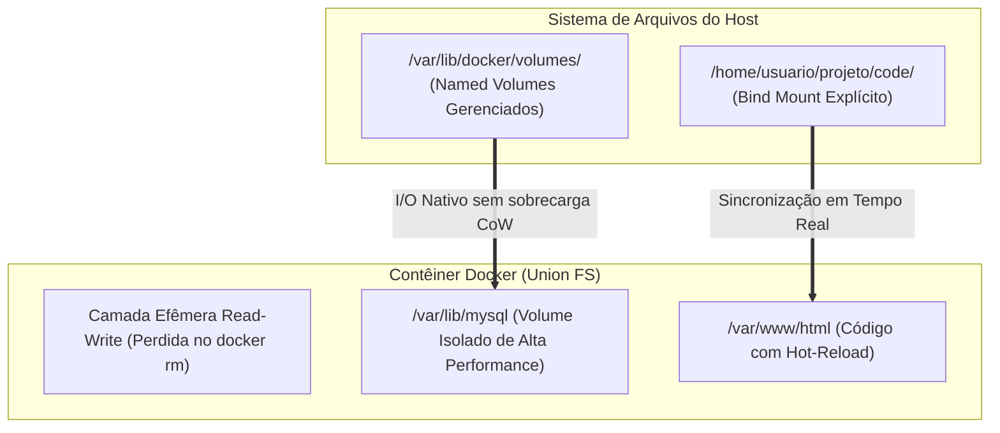
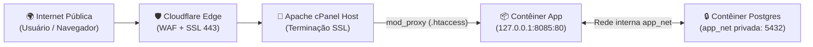

# 🚀 Aula 03: Persistência de Dados (Volumes), Topologia de Redes e Isolamento de Portas (Nível N2)

> [!tldr] Resumo Executivo (Totem da Aula)
> - **Conceito Central:** Contêineres devem ser stateless; qualquer estado persistente (dados de banco de dados, uploads, certificados) exige o desacoplamento das camadas Union FS através de **Named Volumes** ou **Bind Mounts**. Em paralelo, a segurança de rede exige o confinamento em redes privadas com bind exclusivo em loopback (`127.0.0.1`).
> - **Por quê:** Gravar dados em camadas do contêiner impõe degradação severa de I/O e risco de perda total de dados. Expor portas em `0.0.0.0` expõe bancos e serviços internos à internet pública sem passar por WAFs ou proxies reversos.
> - **Aplicação no CTDOL:** Seguir a política de segurança da DOC_OF_002_Matriz_Portas_e_Servicos_VPS e DOC_OF_003_Matriz_Portas_Docker_Local_Dev, isolando o PostgreSQL do SSO Keycloak e roteando tráfego exclusivamente via Apache com terminação SSL.

---

## ⚡ Glossário de Termos Rápidos (Flashcards — Regra 10.1)

- **Named Volume (Volume Nomeado):** Diretório gerenciado nativamente pelo Docker sob `/var/lib/docker/volumes/`, com ciclo de vida independente dos contêineres, ideal para bancos de dados corporativos.
- **Bind Mount:** Mecanismo de montagem direta de um caminho arbitrário do sistema de arquivos do host para dentro do contêiner (`-v /opt/app:/var/www`), ideal para sincronização em desenvolvimento.
- **Data Volume Container:** Padrão arquitetural em que um contêiner dormente é provisionado exclusivamente para ancorar volumes e compartilhá-los com outros contêineres via `--volumes-from`.
- **Bridge Network (`docker0`):** Interface de rede virtual padrão criada no Linux pelo Docker, atuando como um switch de software que conecta contêineres em uma sub-rede privada com NAT.
- **Port Binding (Mapeamento de Portas):** Encaminhamento explícito de portas do host para a porta do contêiner (`-p IP:porta_host:porta_container`), regido por regras de `iptables`.
- **DNS Embutido do Docker:** Mecanismo de resolução automática de nomes de rede que permite que contêineres na mesma rede customizada comuniquem-se utilizando os nomes de seus serviços sem IPs fixos.
- **Loopback Binding (`127.0.0.1`):** Prática mandatória de segurança que restringe a escuta de uma porta apenas à interface local do servidor, impedindo o acesso vindo de redes externas.
- **Modo de Rede Host (`--net=host`):** Configuração em que o contêiner remove seu namespace de rede e utiliza diretamente a interface e tabela de roteamento do servidor host.

---

## 💾 1. A Estratégia de Persistência: Volumes vs Bind Mounts



### Rotina Universal de Backup com Contêiner Descartável
A melhor prática para backup de um volume sem parar o Docker Daemon:

```bash
# Executa um contêiner descartável que monta o volume e gera um arquivo compactado no diretório atual
docker run --rm \
  --volumes-from meu-banco-dados \
  -v $(pwd):/backup \
  ubuntu tar cvf /backup/banco_backup_$(date +%Y%m%d).tar /var/lib/postgresql/data
```

---

## 🌐 2. Topologia de Redes e a Regra de Ouro de Segurança

Por padrão, rodar `docker run -p 8080:80` faz o bind em `0.0.0.0:8080`, expondo a porta para o mundo inteiro!

### A Arquitetura Segura Institucional do CTDOL (Loopback + Proxy Reverso)



### Regra de Configuração Segura no Compose:
```yaml
services:
  web:
    image: ctdol/app:1.0.0
    ports:
      # CORRETO: Confinado em localhost
      - "127.0.0.1:8085:80"
      # PROIBIDO: Exposição em 0.0.0.0
      # - "8085:80"
    networks:
      - app_net

  db:
    image: postgres:15-alpine
    # Banco NÃO possui mapeamento de porta externa!
    expose:
      - "5432"
    networks:
      - app_net

networks:
  app_net:
    driver: bridge
```

---

## 🔗 Conexões & Grafo
- **MOC do Curso:** 00_MOC_Curso_Containers_Docker
- **Aula Anterior:** Aula_02_Ciclo_de_Vida_Dockerfile_Camadas_Imutaveis_N1
- **Próxima Aula:** Aula_04_Producao_Anti_OOM_Compose_Swarm_Alpine_N3
- **Matriz de Portas VPS:** DOC_OF_002_Matriz_Portas_e_Servicos_VPS
- **Matriz de Portas Dev:** DOC_OF_003_Matriz_Portas_Docker_Local_Dev
