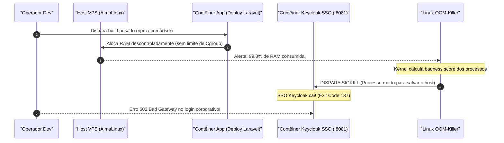

# 🦾 Aula 04: Produção de Alta Resiliência, Engenharia Anti-OOM, Compose e Alpine Linux (Nível N3)

> [!tldr] Resumo Executivo (Totem da Aula)
> - **Conceito Central:** Operar Docker em ambientes de produção corporativos exige governança física estrita de memória (RAM) e CPU via Cgroups para neutralizar o temido Linux OOM-Killer (*Out Of Memory*), associada à especificação declarativa via Docker Compose e à minimização drástica de superfície de ataque com Alpine Linux.
> - **Por quê:** O Docker por padrão não impõe limites de recursos. Um vazamento de memória (*memory leak*) ou uma compilação de código desgovernada em um contêiner esgota a RAM do servidor host, forçando o kernel do Linux a encerrar processos vitais arbitrariamente.
> - **Aplicação no CTDOL:** Lição indelével do incidente real INC_001_Queda_SSO_OOM_Deploy_Laravel: obrigatoriedade de limites de hardware (`deploy.resources.limits`) e transição definitiva dos serviços para Alpine Linux na Nuvem Soberana OCI VPS (00_MOC_INFRA_VPS_OCI).

---

## ⚡ Glossário de Termos Rápidos (Flashcards — Regra 10.1)

- **OOM-Killer (Out-Of-Memory Killer):** Mecanismo de emergência do kernel Linux que, ao detectar esgotamento total de memória RAM física e swap, escolhe e finaliza processos de maior consumo (*badness score*) para evitar um Kernel Panic global.
- **Exit Code 137:** Código de saída retornado pelo Docker quando um contêiner é sumariamente encerrado pelo sinal `SIGKILL (9)` disparado pelo Linux OOM-Killer ($128 + 9 = 137$).
- **Flag `--memory` (`-m`):** Parâmetro de Cgroup que define o teto máximo de memória física utilizável pelo contêiner (ex: `-m 512m`), isolando o impacto de estouros de memória.
- **Flag `--cpu-shares`:** Prioridade proporcional de alocação de ciclos de processador entre contêineres concorrentes em momentos de sobrecarga de CPU (padrão 1024).
- **Restart Policy (`--restart=always`):** Diretiva de resiliência que comanda o Docker Daemon a restabelecer o contêiner automaticamente em caso de crashes ou reboot do servidor físico.
- **Alpine Linux:** Distribuição Linux de segurança reforçada e tamanho microscópico (~5 MB), construída sobre a biblioteca C `musl` e `busybox`, que minimiza vulnerabilidades CVE e acelera cold starts.
- **Multi-Stage Build:** Técnica de Dockerfile que utiliza múltiplas instruções `FROM` para compilar código e dependências em estágios temporários, copiando apenas os binários finais enxutos para a imagem de produção.
- **Docker Remote API:** Interface de programação de aplicações RESTful exposta pelo Docker Daemon através de socket UNIX (`/var/run/docker.sock`) ou TCP seguro com TLS (porta 2376), viabilizando orquestração programática.
- **Compose Profile:** Rótulo que condiciona a subida de um serviço à ativação explícita do seu profile (`--profile X` ou `COMPOSE_PROFILES=X`); serviços sem profile sobem sempre.
- **Merge Multi-Arquivo:** Combinação de manifestos Compose na ordem da linha de comando (`-f base.yml -f prod.yml`), em que escalares substituem, listas concatenam e mapas mesclam por chave.
- **Buildx:** Plugin de build do Docker que produz imagens para múltiplas arquiteturas (`--platform linux/amd64,linux/arm64`) a partir de um único comando.
- **Manifest List:** Índice que agrupa, sob uma única tag, as variantes da imagem por arquitetura, permitindo que cada host baixe automaticamente a sua.

---

## 🚨 1. O Incidente Real de Produção: A Anatomia do OOM-Killer

No ecossistema CTDOL, a ausência de limites de memória em contêineres causou uma queda de produção documentada no post-mortem INC_001_Queda_SSO_OOM_Deploy_Laravel:



### Como Prevenir Definitivamente no `docker-compose.yml`:
```yaml
services:
  keycloak:
    image: quay.io/keycloak/keycloak:26.7.1
    restart: always
    deploy:
      resources:
        limits:
          cpus: '1.5'
          memory: 1024M
        reservations:
          memory: 512M
```

---

## 🏔️ 2. A Superioridade do Alpine Linux na Prática

Comparativo de pegada de recursos e segurança entre imagens de base para microsserviços:

| Métrica | Ubuntu 22.04 | Debian Bookworm Slim | Alpine Linux 3.20 |
| :--- | :--- | :--- | :--- |
| **Tamanho da Imagem Base** | ~78 MB | ~52 MB | **~5.5 MB** |
| **Biblioteca C** | `glibc` | `glibc` | `musl libc` (segurança reforçada) |
| **Gerenciador de Pacotes** | `apt` (lento, cache pesado) | `apt-get` | `apk` (instantâneo, flag `--no-cache`) |
| **Superfície de Ataque (CVEs)** | Alta (dezenas de binários) | Média | **Mínima** (menos de 15 binários) |
| **Tempo de Pull / Download** | 5 a 15 segundos | 3 a 8 segundos | **< 1 segundo ($O(1)$)** |

---

## 🛠️ 3. Padrão Multi-Stage Build para Aplicações Corporativas

```dockerfile
# ESTÁGIO 1: Compilador Pesado (Descartado após o build)
FROM node:20-alpine AS builder
WORKDIR /app
COPY package*.json ./
RUN npm ci
COPY . .
RUN npm run build

# ESTÁGIO 2: Runtime Mínimo de Produção (Apenas o estritamente necessário)
FROM nginx:alpine
COPY --from=builder /app/dist /usr/share/nginx/html
COPY ./nginx.conf /etc/nginx/conf.d/default.conf
EXPOSE 80
CMD ["nginx", "-g", "daemon off;"]
```

---

## 🧪 4. TDD de Infraestrutura: a Imagem Também se Testa

Um `Dockerfile` que **builda com sucesso** não é prova de que produziu o estado esperado. TDD de Infraestrutura aplica os princípios do Test-Driven Development à imagem: escreve-se a asserção do estado desejado e verifica-se contra o contêiner real.

### O padrão declarativo (Serverspec)
A obra de referência ensina a validação via Serverspec, cujas asserções expressam o estado esperado de forma legível:

```ruby
describe package('nginx') do
  it { should be_installed }
end

describe service('nginx') do
  it { should be_running }
end

describe port(80) do
  it { should be_listening }
end
```

### O que testar em uma imagem corporativa
| Asserção | O que ela protege |
| :--- | :--- |
| Pacote instalado | Falha silenciosa de `apk add`/`apt-get` que o build não denunciou |
| Serviço em execução | `ENTRYPOINT` que sobe mas morre logo após |
| Porta escutando | Bind em interface errada dentro do contêiner |
| Usuário do processo | Regressão de segurança: o processo voltou a rodar como root |

> [!info] Nota de linhagem
> Serverspec (Ruby) é a ferramenta ensinada no tratado de referência e permanece didaticamente válida para fixar o **conceito**. Em esteiras novas, a mesma verificação costuma ser feita com asserções sobre `docker inspect` e testes de fumaça no job de CI — o princípio é idêntico: *a imagem é um artefato e artefatos se testam*. A escolha da ferramenta em projetos do cofre deve ser registrada em ADR própria.

> [!warning] Onde este teste pertence
> A validação roda **antes** da promoção da imagem, no pipeline — nunca contra o contêiner já em produção.

---

## 🌐 5. Composição Multi-Ambiente: Profiles e Merge de Arquivos

Uma stack raramente roda em um só ambiente. A prática oficial recomendada **não** é manter um arquivo completo por ambiente — é uma **base comum acrescida de overrides finos**.

### 5.1 Merge multi-arquivo
Compose mescla os arquivos na ordem em que aparecem na linha de comando:

```bash
docker compose -f compose.yaml -f compose.prod.yaml up -d
```

| Tipo de campo | Comportamento no merge |
| :--- | :--- |
| Escalares (`image`, `restart`) | O último **substitui** o anterior |
| Listas (`ports`, `volumes`) | **Concatenam** |
| Mapas (`environment`, `labels`) | **Mesclam por chave** |

Isso permite trocar apenas a origem da imagem — de `build:` local para `image: ghcr.io/...` — sem reescrever a topologia inteira de serviços, redes e volumes.

### 5.2 Profiles: ligar e desligar serviços por contexto
Serviços **sem** profile sobem sempre. Serviços **com** profile só sobem quando ele é ativado:

```yaml
services:
  api:
    image: ghcr.io/ctdol/api:1.4.2      # sem profile: sobe sempre

  adminer:
    image: adminer
    profiles: [debug]                    # só sobe se 'debug' for ativado
```

```bash
docker compose --profile debug up -d
# ou, no job de CI:
COMPOSE_PROFILES=debug docker compose up -d
```

> [!warning] O antipadrão que este mecanismo previne
> Manter `docker-compose.yml`, `docker-compose.prod.yml` e `docker-compose.hml.yml` completos e independentes garante que eles **divergirão silenciosamente** ao longo do tempo — e a divergência só aparece durante um incidente em produção.

---

## 🏗️ 6. Build Multiplataforma com Buildx (ARM64)

As VPS Ampere A1 da OCI são **ARM64**; as estações de desenvolvimento normalmente são **amd64**. Uma imagem construída localmente sem cuidado simplesmente não executa no destino.

```bash
# Constrói e publica as duas arquiteturas sob a mesma tag
docker buildx build \
  --platform linux/amd64,linux/arm64 \
  -t ghcr.io/ctdol/api:1.4.2 \
  --push .
```

O registry recebe uma **manifest list**: cada host baixa automaticamente a variante da sua arquitetura, sem que a tag precise mudar.

> [!info] Requisito do builder
> A documentação oficial declara: *"Multi-platform images require an image store that supports manifest lists."* Docker Desktop e Engine 29.0+ usam containerd por padrão, sem configuração adicional.

---

## 📋 Changelog
- 2026-09-18 (🟣 Claude Code): Encaixe das **Seções 5 (Compose profiles e merge multi-arquivo)** e **6 (build multiplataforma com Buildx)**, mais 4 flashcards. Correção de drift: a Trilha v1.1.0 passou a anunciar esses dois tópicos no N3, mas a aula ainda não os cobria. Fontes: Modelo_Docker_Compose_Multi_Ambiente e Modelo_Docker_Buildx_Multiplataforma. Acrescida também a **Seção 4 (TDD de Infraestrutura)**, fechando lacuna pré-existente: a Trilha anunciava o tópico no N3 desde a homologação, mas a aula não o cobria — conteúdo derivado de Fichamento_Containers_Docker_Cap08_10_Ecosistema_Avancado_API_Swarm. Seções 1 a 3 preservadas integralmente.

---

## 🔗 Conexões & Grafo
- **MOC do Curso:** 00_MOC_Curso_Containers_Docker
- **Aula Anterior:** Aula_03_Volumes_Persistencia_Redes_Isolamento_N2
- **Próxima Aula:** Aula_05_Seguranca_Hardening_Rootless_Capabilities_N4
- **Laboratório Prático:** Lab_Pratico_Containers_Docker_Compose
- **Post-Mortem Fundamental:** INC_001_Queda_SSO_OOM_Deploy_Laravel
- **Nuvem Soberana Destino:** 00_MOC_INFRA_VPS_OCI
- **Fontes Oficiais:** Modelo_Docker_Compose_Multi_Ambiente | Modelo_Docker_Buildx_Multiplataforma
