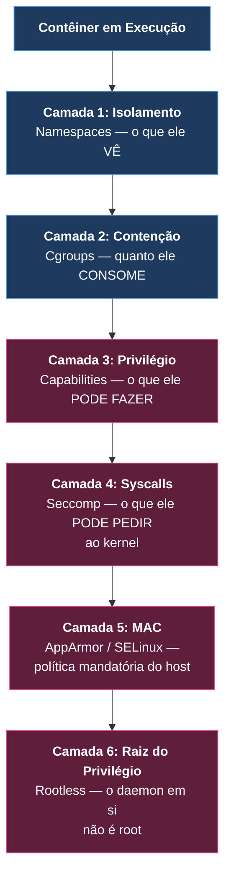

# 🛡️ Aula 05: Segurança de Contêineres — Hardening, Capabilities e Rootless Mode (Nível N4)

> [!tldr] Resumo Executivo (Totem da Aula)
> - **Conceito Central:** Isolamento e privilégio são eixos **ortogonais**. Namespaces e cgroups (Aula 01) impedem que um contêiner *veja* o outro; capabilities, seccomp e AppArmor determinam o que ele *pode fazer* no kernel. Dominar o primeiro sem o segundo produz contêineres isolados e ainda assim perigosos.
> - **Por quê:** A documentação oficial afirma que contêineres são "by default, quite secure" — **mas condiciona a afirmação** a que os processos rodem como usuários não-privilegiados. Um contêiner rodando como root, com todas as capabilities, anula boa parte da garantia de isolamento.
> - **Aplicação no CTDOL:** As cargas do ecossistema rodam em VPS pública (OCI Ampere A1, HostGator). Esta aula fornece o vocabulário para responder tecnicamente à pergunta "esse contêiner é seguro?" e sustenta a política de ADR_036_docker_Governanca_Imagens_Conteineres_Volumes.

---

## ⚡ Glossário de Termos Rápidos (Flashcards — Regra 10.1)

- **Capability (Linux):** Unidade atômica de privilégio do kernel. Substitui o binário root/não-root por permissões granulares — `NET_BIND_SERVICE` permite abrir portas abaixo de 1024 sem conceder o restante do poder de root.
- **Capability Dropping:** Prática de derrubar todas as capabilities (`cap_drop: ALL`) e devolver apenas as estritamente necessárias (`cap_add`).
- **Seccomp (Secure Computing Mode):** Perfil que restringe quais **chamadas de sistema (syscalls)** o processo do contêiner pode emitir ao kernel.
- **AppArmor / SELinux:** Módulos de Controle de Acesso Mandatório (MAC) do kernel Linux, que aplicam políticas independentes do modelo de permissões do próprio Docker.
- **User Namespace (userns):** Mapeia o usuário root de dentro do contêiner para um usuário não-privilegiado no host, de modo que uma fuga não entregue root real.
- **`userns-remap`:** Modo em que os contêineres são remapeados, mas **o daemon Docker continua rodando como root**.
- **Rootless Mode:** Modo em que **nem o daemon nem os contêineres** rodam como root, eliminando o daemon privilegiado como superfície de ataque.
- **`no-new-privileges`:** Flag que impede que um processo dentro do contêiner ganhe privilégios adicionais via binários `setuid`.
- **Docker Content Trust:** Verificação de assinatura criptográfica da imagem antes da execução — elo entre segurança de runtime e de cadeia de suprimento.

---

## 🏛️ 1. Os Quatro Pilares Declarados

A documentação oficial organiza a segurança do Engine em quatro eixos. Note que **os dois primeiros já foram estudados na Aula 01** — esta aula acrescenta os dois seguintes.

| # | Pilar | O que resolve | Onde foi estudado |
| :--- | :--- | :--- | :--- |
| 1 | **Kernel Namespaces** | Isolamento: um contêiner não enxerga processos, rede ou montagens do outro. | Aula_01_Fundamentos_Virtualizacao_Namespaces_Cgroups_N0 |
| 2 | **Control Groups** | Contabilidade de recursos e prevenção de negação de serviço (anti-OOM). | Aula_01_Fundamentos_Virtualizacao_Namespaces_Cgroups_N0 · Aula_04_Producao_Anti_OOM_Compose_Swarm_Alpine_N3 |
| 3 | **Superfície do daemon** | Controle de acesso à API do Docker — quem fala com o daemon, fala como root. | **Esta aula** |
| 4 | **Kernel Capabilities** | Redução fina de privilégio dentro do contêiner. | **Esta aula** |



> [!warning] A superfície de ataque do daemon
> Quem tem acesso ao socket do Docker tem, na prática, **root no host** — basta montar o sistema de arquivos do host em um contêiner privilegiado. Por isso, montar `/var/run/docker.sock` dentro de um contêiner é uma decisão de segurança grave, jamais uma conveniência.

---

## 🔻 2. Capability Dropping na Prática

A postura correta é **negar tudo e devolver o mínimo**:

```yaml
services:
  api:
    image: ghcr.io/ctdol/api:1.4.2      # nunca :latest (ADR 036)
    user: "1000:1000"                    # não rodar como root no contêiner
    cap_drop:
      - ALL                              # derruba todas as capabilities
    cap_add:
      - NET_BIND_SERVICE                 # devolve apenas a necessária
    security_opt:
      - no-new-privileges:true           # bloqueia escalonamento via setuid
    read_only: true                      # raiz imutável em runtime
    tmpfs:
      - /tmp                             # escrita efêmera onde for indispensável
```

| Diretiva | Ataque que mitiga |
| :--- | :--- |
| `user: "1000:1000"` | Processo comprometido não age como root nem dentro do contêiner. |
| `cap_drop: ALL` | Remove poderes de kernel raramente necessários (`SYS_ADMIN`, `SYS_PTRACE`, `NET_ADMIN`). |
| `no-new-privileges:true` | Impede escalonamento por binário `setuid` presente na imagem. |
| `read_only: true` | Impede que um invasor persista payload no sistema de arquivos. |

---

## 🧬 3. Rootless Mode vs. `userns-remap` — Onde Mora o Privilégio

Ambos usam user namespaces, mas resolvem problemas diferentes. A distinção é **de localização do privilégio**, não de grau:

> *"with `userns-remap` mode, the daemon itself is running with root privileges, whereas in rootless mode, both the daemon and the container are running without root privileges."*

| | `userns-remap` | **Rootless Mode** |
| :--- | :--- | :--- |
| Contêiner roda como root real? | Não (remapeado) | Não |
| **Daemon roda como root?** | **Sim** | **Não** |
| Protege contra | Fuga de contêiner | Fuga de contêiner **e** comprometimento do daemon |

### Pré-requisitos declarados do Rootless

- Pacote `uidmap` instalado (fornece `newuidmap` e `newgidmap`).
- Ao menos **65.536 UIDs/GIDs subordinados** em `/etc/subuid` e `/etc/subgid` para o usuário.
- Instalação via `dockerd-rootless-setuptool.sh install` (Docker 20.10+, RPM/DEB) ou script em `https://get.docker.com/rootless`.
- **Não suportado em arquitetura s390x.**

```bash
# Checagem de pré-requisito antes de qualquer proposta de migração
command -v newuidmap newgidmap
grep "^$USER:" /etc/subuid /etc/subgid   # esperado: ao menos 65536 IDs
docker info | grep -i rootless           # verificação pós-instalação
```

> [!caution] Trava de governança do CTDOL
> Rootless mode possui limitações operacionais declaradas pela própria documentação. Migrar as VPS do cofre exige **ADR própria**, precedida de medição real no ambiente-alvo — sem métricas estimadas (Regra 13.1) e sem alterar produção fora da esteira formal de deploy.

---

## 🎯 4. Checklist de Hardening para Revisão de Código

Aplicável a qualquer `compose` ou `Dockerfile` submetido a revisão no ecossistema CTDOL:

- [ ] A imagem tem **tag de versão explícita** (nunca `:latest`)?
- [ ] O processo roda como **usuário não-root** (`USER` no Dockerfile ou `user:` no compose)?
- [ ] As capabilities foram **derrubadas e seletivamente devolvidas**?
- [ ] `no-new-privileges` está habilitado?
- [ ] O sistema de arquivos raiz é **read-only**, com `tmpfs` apenas onde a escrita é indispensável?
- [ ] O socket do Docker **não** está montado dentro do contêiner?
- [ ] As portas estão confinadas em **loopback** quando não precisam ser públicas?
- [ ] A imagem base é **minimalista** (Alpine, slim, distroless) para reduzir a superfície?

---

## 📋 Changelog
- 2026-09-18 (🟣 Claude Code): Criação da aula, elevando a trilha de N0–N3 para **N0–N4** e fechando a lacuna de segurança medida na auditoria do curso (capabilities, seccomp, AppArmor, userns e rootless tinham cobertura zero). Fonte: Modelo_Docker_Engine_Seguranca (Docker Inc., ingestão via Fluxo_016_Agente_Bibliotecario_Ingestao_Obras).

---

## 🔗 Conexões & Grafo
- **MOC do Curso:** 00_MOC_Curso_Containers_Docker
- **Aula Anterior:** Aula_04_Producao_Anti_OOM_Compose_Swarm_Alpine_N3
- **Base Conceitual (Namespaces e Cgroups):** Aula_01_Fundamentos_Virtualizacao_Namespaces_Cgroups_N0
- **Fonte Oficial:** Modelo_Docker_Engine_Seguranca
- **Fichamentos de Apoio:** Fichamento_Docker_Security_Cap01_Pilares_Capabilities_Seccomp_AppArmor | Fichamento_Docker_Security_Cap02_Rootless_Mode_vs_Userns_Remap
- **Norma Arquitetural:** ADR_036_docker_Governanca_Imagens_Conteineres_Volumes
- **Infra Relacionada:** ADR_001_infra-vps-oci_Setup_Inicial_Ampere_A1_e_Docker
- **Curador Epistêmico:** ERASTOS
