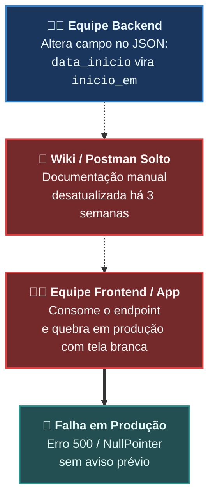

# 🔰 Aula 01: Fundamentos de Contratos de API, Anatomia da OpenAPI 3.1 e a Suíte Swagger (Nível N0–N1)

> [!tldr] Resumo Executivo (Totem da Aula)
> - **Conceito Central:** Uma API HTTP sem contrato formal é uma dívida técnica viva. A especificação **OpenAPI 3.1** estabelece um contrato formal de dados legível por humanos e computadores, enquanto o **Swagger** fornece a suíte de ferramentas interativas para edição, visualização e testes.
> - **Por quê:** Documentação em texto estático (wikis, PDFs, planilhas) desatualiza-se na primeira alteração de código e passa a mentir. O contrato formal OpenAPI funciona como uma "certidão de nascimento" da interface, permitindo validação automática, geração de clientes e desacoplamento seguro entre equipes.
> - **Aplicação no CTDOL:** No desenvolvimento de soluções como a plataforma ANAMNESE e sistemas corporativos, o contrato OpenAPI protege o frontend e clientes externos de quebras acidentais de payload e tipos.

---

## ⚡ Glossário de Termos Rápidos (Flashcards — Regra 10.1)

- **OpenAPI Specification (OAS):** Padrão aberto global (gerenciado pela *OpenAPI Initiative* sob a *Linux Foundation*) para descrição declarativa de interfaces RESTful em formato JSON ou YAML, independente de linguagem de programação.
- **Swagger:** Conjunto de ferramentas de código aberto (criadas originalmente pela SmartBear) para implementar a especificação OpenAPI, incluindo o Swagger UI (interface gráfica interativa), Swagger Editor e Swagger Codegen.
- **Contract-First (API-First):** Abordagem de engenharia em que o contrato OpenAPI é redigido e aprovado antes de qualquer linha de código backend ou frontend ser escrita.
- **Code-First (Docs-as-Code):** Abordagem em que a especificação OpenAPI é gerada de forma automatizada e contínua a partir do próprio código-fonte, tipos e decoradores da aplicação (como em FastAPI e SpringDoc).
- **Paths Object:** Seção central do OpenAPI que mapeia os endpoints relativos da API (ex.: `/sessoes`, `/pacientes`) e as operações HTTP suportadas.
- **Operation Object:** Definição de uma ação HTTP específica em uma rota (ex.: `get`, `post`, `delete`), contendo descrição, parâmetros, corpo da requisição e respostas.
- **Components / Schemas:** Seção do OpenAPI destinada à reutilização de estruturas de dados (Data Transfer Objects - DTOs), evitando duplicação de definições de payload (*DRY - Don't Repeat Yourself*).
- **Request Body:** Conteúdo do payload enviado pelo cliente em operações como `POST` e `PUT`, associado a um tipo MIME (geralmente `application/json`) e a um schema.
- **Status Code Semântico:** Código numérico de 3 dígitos do protocolo HTTP que comunica o resultado da operação (ex.: 200 sucesso, 201 criado, 403 não autorizado pelo domínio, 422 validação de negócio falhou).

---

## 🏛️ 1. O Problema Fundamental: A Dor da API sem Contrato

Antes da padronização dos contratos de API, a comunicação entre quem desenvolve o backend e quem consome a interface enfrentava o clássico abismo da incompatibilidade:



### O que o Tratado de Engenharia nos Ensina:
Conforme Marco Tulio Valente destaca em *Fundamentos de Manutenção de Software* (Capítulo 3):
> *"Comentários e documentos manuais que tentam descrever payloads de sistemas tornam-se obsoletos quase imediatamente. A documentação técnica precisa ser um contrato vivo, acoplado ao ciclo de entrega do software (Docs-as-Code)."*

---

## 🧭 2. OpenAPI vs Swagger: Desfazendo a Confusão Histórica

É muito comum encontrar desenvolvedores usando os termos como sinônimos. Contudo, há uma distinção arquitetural e histórica rigorosa:

| Critério | OpenAPI Specification (OAS) | Swagger |
| :--- | :--- | :--- |
| **O que é?** | É uma **norma / especificação de formato** (especificação escrita em ISO-style). | É uma **suíte de softwares e ferramentas**. |
| **Entidade Gestora** | *OpenAPI Initiative* (consórcio aberto da Linux Foundation). | SmartBear Software (empresa mantenedora das ferramentas). |
| **Papel Prático** | Define as regras do documento JSON/YAML (o contrato formal). | Fornece a interface web interativa (**Swagger UI**), editor e geradores de código. |
| **Exemplo Real** | `openapi: 3.1.0` no topo do arquivo de contrato. | A tela do navegador em `http://127.0.0.1:8086/docs` onde você clica em *Try it out*. |

---

## 📐 3. A Anatomia de um Documento OpenAPI 3.1

Um documento OpenAPI pode ser escrito em **YAML** (mais legível para humanos) ou **JSON** (ideal para processamento por máquinas). A versão moderna **OpenAPI 3.1** possui total compatibilidade com o padrão **JSON Schema Draft 2020-12**.

Abaixo, a estrutura hierárquica fundamental:

```yaml
openapi: 3.1.0
info:
  title: API Plataforma ANAMNESE
  version: 1.0.0
  description: API para custódia de memória clínica e gestão de prontuários.
servers:
  - url: http://127.0.0.1:8086
    description: Servidor de Desenvolvimento Local

paths:
  /sessoes:
    post:
      summary: Registra um novo atendimento clínico
      operationId: criarSessao
      tags:
        - Sessões Clínicas
      requestBody:
        required: true
        content:
          application/json:
            schema:
              $ref: '#/components/schemas/NovaSessaoRequest'
      responses:
        '201':
          description: Sessão agendada com sucesso.
          content:
            application/json:
              schema:
                $ref: '#/components/schemas/SessaoResponse'
        '403':
          description: Consentimento ativo ausente para o paciente informado.
        '422':
          description: Erro de validação sintática ou regra de negócio violada.

components:
  schemas:
    NovaSessaoRequest:
      type: object
      required:
        - paciente_id
        - ocorrida_em
      properties:
        paciente_id:
          type: string
          format: uuid
          example: "3fa85f64-5717-4562-b3fc-2c963f66afa6"
        ocorrida_em:
          type: string
          format: date-time
          example: "2026-10-02T14:30:00Z"
        modalidade:
          type: string
          enum: [presencial, online]
          default: presencial

    SessaoResponse:
      type: object
      properties:
        id:
          type: string
          format: uuid
        status:
          type: string
          example: "agendada"
```

### Elementos Críticos da Anatomia:
1. **`$ref` (Pointers):** Permite reutilizar schemas definidos em `components.schemas`. Se o modelo do `Paciente` mudar, altera-se em um único lugar e todos os endpoints refletem a mudança.
2. **Substantivos no Plural:** Rotas devem representar coleções de recursos (`/sessoes`, `/pacientes`), nunca verbos (`/criarSessao` é um anti-padrão).
3. **Status Codes Semânticos:**
   - `201 Created`: Novo recurso persistido no banco com sucesso.
   - `400 Bad Request`: Payload JSON malformado ou ilegível.
   - `401 Unauthorized`: Cliente não forneceu credenciais válidas.
   - `403 Forbidden`: Cliente identificado, mas barrado por regra de domínio (ex: sem consentimento).
   - `422 Unprocessable Entity`: Formato JSON correto, mas valores violam restrições de validação.

---

## 🔀 4. Abordagens de Projeto: Contract-First vs Code-First

```
┌─────────────────────────────────────────────────────────────────────────────────┐
│                       CONTRACT-FIRST vs CODE-FIRST                              │
├─────────────────────────────────────────────────────────────────────────────────┤
│                                                                                 │
│   CONTRACT-FIRST (Design-First):                                                │
│   [Arquitetura] ──► Desenha OpenAPI (YAML) ──► Gera Stubs Backend & Frontend    │
│   Ideal para: Times grandes, microsserviços integrados por múltiplos setores.   │
│                                                                                 │
│   CODE-FIRST (Docs-as-Code):                                                    │
│   [Engenharia]  ──► Escreve Código & Tipos ──► OpenAPI Gerado Automaticamente   │
│   Ideal para: Desenvolvimento ágil com linguagens fortemente tipadas (Python    │
│               FastAPI, TypeScript NestJS, C# .NET Core, Java Spring Boot).      │
│                                                                                 │
└─────────────────────────────────────────────────────────────────────────────────┘
```

No ecossistema **CTDOL** e no projeto `ANAMNESE`, adotamos a excelência da abordagem **Code-First orientada a tipos (Docs-as-Code)**: escrevemos os modelos no Pydantic/Python com tipagem estrita; o FastAPI analisa os tipos e emite o OpenAPI 3.1 oficial em tempo de execução sem retrabalho manual!

---

## 💡 Como Funciona na Prática: Exemplo Real do Domínio

Imagine que a psicóloga Dra. Helena abre a plataforma para iniciar uma consulta:
1. O frontend faz uma chamada `POST /sessoes/{id}/audio`.
2. O contrato OpenAPI define com precisão cirúrgica:
   - Parâmetro `{id}` deve ser um UUID v4 válido na URL.
   - O corpo da mensagem deve ser um arquivo multipart binário (`audio/wav`).
   - Se o paciente não tiver o termo de consentimento assinado, o endpoint deve retornar compulsoriamente HTTP `403 Forbidden` acompanhado de um schema de erro padronizado.
3. Se um desenvolvedor do frontend tentar enviar um áudio em formato de texto JSON, a própria validação do contrato rejeita a requisição na borda antes de onerar o servidor.

---

## 📝 Exercício de Fixação (Autoavaliação)

**Cenário:** Você precisa desenhar o endpoint para a profissional revogar o consentimento de gravação de um paciente específico.
- **Pergunta 1:** Qual é a URL mais adequada segundo as boas práticas REST e OpenAPI?
  *(A) `/revogarConsentimento?paciente=123`*  
  *(B) `DELETE /pacientes/{id}/consentimentos` ou `POST /consentimentos/{id}/revogacao`*  
  *(C) `POST /paciente/revoga/123`*  
  *Resposta Correta:* **(B)** — Recursos são substantivos (`consentimentos` ou sub-recurso), e a ação é expressa por método HTTP (`DELETE`) ou sub-recurso explícito de transição de estado.

---

## 🔗 Conexões & Grafo
- **Central do Curso:** 00_MOC_Nano_Curso_OpenAPI_Swagger
- **Próxima Aula:** Aula_02_Docs_as_Code_FastAPI_e_Clientes_N2_N3
- **Diretriz de Design de API:** api-design
- **Tratado de Referência:** Fichamento_Manutencao_Software_Cap_03
