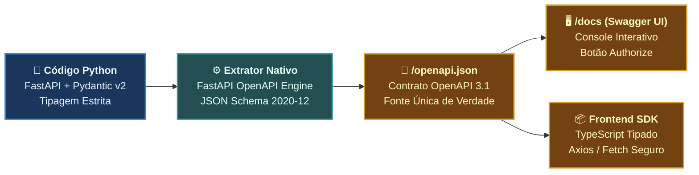

# 🚀 Aula 02: Docs-as-Code na Prática: FastAPI, Swagger UI, Geração de Clientes e Linters (Nível N2–N3)

> [!tldr] Resumo Executivo (Totem da Aula)
> - **Conceito Central:** Materialização prática do paradigma *Docs-as-Code*. Demonstração de como frameworks modernos como **FastAPI (Python)** e **Pydantic** sintetizam a especificação OpenAPI 3.1 automaticamente sem retrabalho manual, alimentando a interface interativa **Swagger UI** e permitindo a geração automática de SDKs tipados para o frontend (TypeScript/Axios).
> - **Por quê:** Escrever contratos YAML na mão é propenso a erros de digitação e descontinuidade. Gerar o contrato a partir do código tipado garante que a documentação é 100% verídica e que o compilador/linter protege o contrato contra quebras acidentais.
> - **Aplicação no CTDOL:** No projeto ANAMNESE e em todos os backends da organização, o endpoint `/openapi.json` alimenta testes automatizados e o Swagger UI (`/docs`) funciona como ambiente oficial de testes de desenvolvimento.

---

## ⚡ Glossário de Termos Rápidos (Flashcards — Regra 10.1)

- **Pydantic Model:** Classe Python baseada em `pydantic.BaseModel` que executa validação de tipos em tempo de execução e serialização de dados, exportando esquemas JSON Schema compatíveis com OpenAPI 3.1.
- **Swagger UI (`/docs`):** Interface web dinâmica gerada a partir do `/openapi.json` que permite visualizar endpoints, ler descrições e executar requisições HTTP interativas (*Try it out*) direto do navegador.
- **ReDoc (`/redoc`):** Interface gráfica alternativa e elegante para visualização de contratos OpenAPI, focada em legibilidade e navegação por documentação técnica densa.
- **Security Scheme (OAuth2/Bearer):** Objeto de configuração do OpenAPI que declara como os clientes devem se autenticar (ex.: cabeçalho `Authorization: Bearer <token>`), habilitando o botão de cadeado interativo no Swagger UI.
- **OpenAPI Generator:** Ferramenta open-source para geração automatizada de bibliotecas de cliente (SDKs), gerando código em TypeScript, Dart, Java, C# ou Go a partir de um contrato OpenAPI.
- **OpenAPI TypeScript:** Ferramenta ultra-leve que transforma arquivos `openapi.json` em definições puras de tipos TypeScript (`.d.ts`), garantindo *Type Safety* completo no frontend sem overhead de bibliotecas pesadas.
- **Spectral (API Linter):** Linter automatizado para arquivos OpenAPI que audita a qualidade do design da API (ex.: exige que toda rota tenha descrição, proíbe URLs em maiúsculas e cobra documentação de erros 4xx/5xx no CI/CD).
- **Hardening de Produção:** Prática de desabilitar o acesso público às rotas `/docs` e `/redoc` em ambientes de produção restritos para mitigar o reconhecimento de superfície por atacantes.

---

## 🏛️ 1. O Pipeline Docs-as-Code com FastAPI & Pydantic

Na abordagem *Docs-as-Code*, os modelos de negócio e os parâmetros das rotas são os próprios geradores do contrato:



---

## 💻 2. Implementação Real: O Código que Gera o Contrato

Abaixo, a implementação idiomática de um módulo de backend (como no `ANAMNESE`):

```python
from datetime import datetime
from uuid import UUID
from fastapi import FastAPI, HTTPException, status, Depends
from pydantic import BaseModel, Field

# 1. Configuração de Metadados Gerais da API
app = FastAPI(
    title="ANAMNESE — Plataforma de Memória Clínica",
    version="1.0.0",
    description="Sistema multi-tenant para degravação e custódia segura de prontuários.",
    openapi_tags=[
        {"name": "Sessões", "description": "Gerenciamento de atendimentos clínicos"},
        {"name": "Prontuários", "description": "Redação e assinatura humana de prontuários (Imutáveis)"},
    ]
)

# 2. Schemas Declarativos Pydantic com Documentação Embutida
class NovaSessaoInput(BaseModel):
    paciente_id: UUID = Field(
        ...,
        description="Identificador único do paciente titular do dado sensível",
        example="9b1deb4d-3b7d-4bad-9bdd-2b0d7b3dcb6d"
    )
    ocorrida_em: datetime = Field(
        ...,
        description="Data e horário real do atendimento",
        example="2026-10-02T10:00:00Z"
    )
    modalidade: str = Field(
        default="presencial",
        description="Formato da sessão: presencial ou online",
        example="presencial"
    )

class SessaoOutput(BaseModel):
    id: UUID
    paciente_id: UUID
    status: str
    criada_em: datetime

class ErroDetalhe(BaseModel):
    codigo: str = Field(..., example="CONSENTIMENTO_AUSENTE")
    mensagem: str = Field(..., example="O paciente não possui consentimento ativo para gravação.")

# 3. Endpoint Mapeado com Status Codes e Erros Documentados
@app.post(
    "/sessoes",
    response_model=SessaoOutput,
    status_code=status.HTTP_201_CREATED,
    tags=["Sessões"],
    summary="Inicia uma nova sessão clínica",
    responses={
        status.HTTP_403_FORBIDDEN: {
            "model": ErroDetalhe,
            "description": "Recusado por ausência de consentimento ativo do paciente."
        },
        status.HTTP_422_UNPROCESSABLE_ENTITY: {
            "description": "Dados da requisição violam as restrições sintáticas."
        }
    }
)
async def criar_sessao(dados: NovaSessaoInput):
    # A regra de domínio é executada aqui
    return SessaoOutput(
        id="c3a4f891-9e2b-4d51-8721-39bc077b9f81",
        paciente_id=dados.paciente_id,
        status="agendada",
        criada_em=datetime.utcnow()
    )
```

### O que acontece quando você roda este código?
1. O FastAPI monta a rota `GET /openapi.json` contendo o contrato formal completo.
2. Acessando `http://localhost:8086/docs`, o **Swagger UI** exibe:
   - Os modelos com todos os exemplos interativos.
   - O botão `Try it out` para disparar requisições de teste sem abrir o Postman.
   - A documentação explícita de que a rota pode responder `201 Created` ou `403 Forbidden`.

---

## 🔐 3. Autenticação e Hardening de Produção

### Como habilitar o botão "Authorize" (Cadeado) no Swagger:
Basta declarar o esquema de segurança com `HTTPBearer` ou `OAuth2PasswordBearer`:

```python
from fastapi.security import HTTPBearer, HTTPAuthorizationCredentials

security = HTTPBearer()

@app.get("/prontuarios/{id}", tags=["Prontuários"])
async def obter_prontuario(id: UUID, credenciais: HTTPAuthorizationCredentials = Depends(security)):
    token = credenciais.credentials
    # Validação do token JWT / SSO
    return {"id": id, "assinado": True}
```

O Swagger UI automaticamente exibirá um botão verde **Authorize** no topo da tela, permitindo colar o Bearer Token uma única vez para testar todas as rotas protegidas!

### Hardening de Segurança em Produção (Flag de Ambiente):
Em ambientes públicos de produção, a documentação Swagger não deve ficar exposta para qualquer visitante da internet:

```python
import os

AMBIENTE = os.getenv("AMBIENTE", "DEV")

app = FastAPI(
    title="ANAMNESE",
    docs_url="/docs" if AMBIENTE == "DEV" else None,
    redoc_url="/redoc" if AMBIENTE == "DEV" else None,
    openapi_url="/openapi.json" if AMBIENTE == "DEV" else None
)
```

---

## 📦 4. Consumo Automático no Frontend (Zero Retrabalho)

Esqueça a época em que o desenvolvedor do frontend precisava reescrever as interfaces TypeScript à mão:

```bash
# Executa no projeto frontend consumindo o contrato do backend
npx openapi-typescript http://127.0.0.1:8086/openapi.json -o src/api/schema.d.ts
```

O arquivo gerado `src/api/schema.d.ts` conterá tipos exatos:
```typescript
export interface paths {
  "/sessoes": {
    post: {
      requestBody: {
        content: {
          "application/json": components["schemas"]["NovaSessaoInput"];
        };
      };
      responses: {
        201: {
          content: {
            "application/json": components["schemas"]["SessaoOutput"];
          };
        };
      };
    };
  };
}
```
Se o backend renomear um campo, o TypeScript do frontend acusa erro de compilação imediatamente, impedindo que bugs cheguem aos usuários!

---

## 🛡️ 5. Governança e Quality Gates com Linters (Spectral)

Assim como temos o ESLint para JavaScript e o Ruff para Python, o **Spectral** é o linter oficial de contratos OpenAPI:

```bash
# Audita o arquivo de contrato contra as regras de estilo corporativas
npx @stoplight/spectral-cli lint openapi.json
```

**Regras auditadas automaticamente pelo CI:**
- ❌ Erro se uma URL contiver letras maiúsculas (`/CriarSessao` rejeitado).
- ❌ Erro se um endpoint não tiver descrição clara.
- ❌ Erro se não houver resposta de erro `4xx` ou `5xx` mapeada.

---

## 💡 Como Funciona na Prática: Exemplo Real do Domínio

No projeto `ANAMNESE`:
1. Criamos a rota de upload `POST /sessoes/{id}/audio` no FastAPI.
2. Na Swagger UI (`/docs`), a psicóloga ou o desenvolvedor vê o campo de anexar arquivo (`UploadFile`).
3. Clica em *Try it out*, seleciona um áudio `.wav` e envia.
4. O Swagger UI faz a requisição real, o FastAPI decodifica o arquivo, cifra em Fernet e aciona o Whisper em contêiner local, devolvendo a transcrição em segundos na tela.
5. Tudo testado sem instalar nenhum cliente externo.

---

## 🔗 Conexões & Grafo
- **Central do Curso:** 00_MOC_Nano_Curso_OpenAPI_Swagger
- **Aula Anterior:** Aula_01_Fundamentos_Contratos_OpenAPI_Swagger_N0_N1
- **Avaliação Moodle:** `openapi_swagger_moodle_aiken.txt`
- **Padrão Docs-as-Code:** ADR_045_governanca_Padrao_CTDOL_Desenvolvimento_Docs_as_Code_C4_Canvas
- **MOC de Origem:** 00_MOC_ANAMNESE
