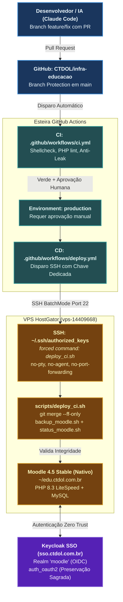

# DOC 002: Instruções para IA Operadora — Acesso ao Repositório, SSH na VPS e Esteira CI/CD

> [!tldr] Resumo Executivo (Totem)
> - **Decisão/Achado:** Formalização das diretrizes operacionais e de governança para qualquer agente de IA ou desenvolvedor que assuma a manutenção e automação do Moodle LMS (`edu.ctdol.com.br`) no repositório `CTDOL/infra-educacao`.
> - **Por quê:** Blindar a integridade da plataforma educacional, a segurança dos dados acadêmicos e a estabilidade da VPS HostGator (onde a conta `ctdolc07` compartilha recursos com outros 33 subdomínios institucionais).
> - **Ação Concreta:** Leitura compulsória do `CLAUDE.md` como norma primária prevalente, observância estrita dos limites inegociáveis de autenticação Keycloak e cPanel/WHM, uso de chaves SSH restritas com *forced command* e esteira determinística de CI/CD no GitHub Actions.

> [!important] Precedência Normativa
> **Leia `CLAUDE.md` primeiro:** Suas regras de segurança (Keycloak SSO OIDC, isolamento da conta cPanel/WHM e proibições no Apache) **prevalecem integralmente** sobre qualquer procedimento deste arquivo.

---

## 🗺️ Topologia da Esteira CI/CD & Borda de Segurança



---

## 0. Limites Inegociáveis

1. **Inviolabilidade do SSO Keycloak:**
   - **NUNCA** alterar ou desativar o plugin `auth_oauth2` nem modificar as configurações do realm `moodle`.
   - Procedimento de *Break-Glass* (reativação temporária de login manual via `admin/cli/cfg.php`) só pode ser realizado sob **pedido explícito do operador**, com plano e reversão imediata documentados.
2. **Integridade do Web Server Apache (cPanel/WHM):**
   - **NUNCA** editar `httpd.conf` ou `apache2.conf` diretamente (o cPanel sobrescreve e destrói alterações manuais).
   - **NUNCA** utilizar comandos `systemctl` ou `service` para reiniciar o Apache (o comando mandatório e seguro é `/scripts/restartsrv_httpd`, executado exclusivamente pelo root).
3. **Proteção de Dados & Sigilo (Zero Leakage):**
   - **NUNCA** expor o diretório `moodledata` para acesso web direto.
   - **NUNCA** commitar ou colar segredos (arquivos `config.php`, `.env`, dumps de banco `.sql`, chaves privadas, client secret do Keycloak) no chat ou no repositório Git. Segredos residem estritamente em **GitHub Secrets** ou em arquivos protegidos no próprio servidor.
4. **Fronteira da Conta Mãe `ctdolc07`:**
   - A conta `ctdolc07` hospeda múltiplos subdomínios institucionais críticos da CTDOL. É **terminantemente proibido** interagir com arquivos fora do perímetro autorizado:
     - `~/edu.ctdol.com.br/` (Raiz web do Moodle)
     - `~/moodledata/` (Armazenamento de dados do Moodle)
     - `~/infra-educacao/` (Repositório de automação e scripts)
     - `~/backups/moodle/` (Diretório de dumps locais)
     - `~/logs/` (Logs operacionais)
5. **Trava de Ações Críticas & Root:**
   - Qualquer ação potencialmente destrutiva, intervenção com privilégios de `root` ou alteração de autenticação exige **confirmação prévia do operador** e a execução preventiva e obrigatória de `bash scripts/backup_moodle.sh`.

---

## 1. Acesso ao Repositório (GitHub)

- **Repositório Central:** `https://github.com/CTDOL/infra-educacao`
- **Branch Base:** `main`.
- **Fluxo de Trabalho Obrigatório:**
  - Trabalhar sempre em branches nomeadas pelo padrão `tipo/descricao` (ex: `feat/backup-rotativo`, `fix/permissoes-cache`).
  - Abrir Pull Request (PR) contra a branch `main`.
- **Credenciais e Instalação da IA:**
  - Requer o GitHub App do Claude ou token com permissões de leitura/escrita no repositório (instalação por administrador da organização em: [https://github.com/apps/claude/installations/select_target](https://github.com/apps/claude/installations/select_target)).
- **Convenção de Commits:**
  - Padrão: `tipo(escopo): descricao [Agente]`, escrito em português (ex: `feat(scripts): adiciona script de verificacao da vps [Claude]`).
  - **NUNCA** fazer push direto na branch `main`.
  - **NUNCA** utilizar `git push --force` em branches colaborativas.

---

## 2. Acesso SSH à VPS (`vps-14409668`, HostGator) & Mandato de Configuração

> [!target] Mandato da IA Operadora para Setup do CI/CD
> A IA operadora (Claude Code) possui autorização expressa para acessar interativamente a VPS via SSH (utilizando as credenciais disponíveis no terminal do operador) para provisionar a infraestrutura de automação, gerar chaves dedicadas, configurar o `authorized_keys` restrito e validar a esteira.

### 2.1. Provisionamento da Chave Dedicada de Deploy (Pela IA no Terminal do Operador)
A IA executa a geração da chave SSH dedicada exclusivamente para as Actions do GitHub (sem passphrase):
```bash
ssh-keygen -t ed25519 -f ~/.ssh/ctdol_deploy -C "github-actions-deploy" -N ""
```

### 2.2. Configuração Automatizada na VPS (Usuário `ctdolc07`)
Conectando via SSH na VPS, a IA instala o script de deploy e registra a chave pública com **restrição estrita a comando fixo (Forced Command)** no `~/.ssh/authorized_keys`:
```text
command="/bin/bash /home/ctdolc07/infra-educacao/scripts/deploy_ci.sh",no-port-forwarding,no-agent-forwarding,no-X11-forwarding,no-pty ssh-ed25519 AAAA... github-actions-deploy
```

### 2.3. Injeção de Segredos no GitHub Repository
A IA (utilizando a CLI `gh` ou orientando o operador) cadastra os segredos no repositório `CTDOL/infra-educacao` sob o Environment `production`:
- `VPS_SSH_KEY`: Conteúdo integral da chave privada recém-gerada (`~/.ssh/ctdol_deploy`).
- `VPS_HOST`: IP ou hostname da VPS HostGator.
- `VPS_USER`: `ctdolc07`.
- `VPS_PORT`: Porta SSH do servidor.
- `VPS_KNOWN_HOSTS`: Saída de `ssh-keyscan -p <porta> <host>` (pinagem explícita do host key; **nunca** usar `StrictHostKeyChecking=no`).

> [!warning] Acesso Root
> Credenciais de acesso `root` **NÃO entram** nas Actions do GitHub. Operações administrativas de sistema operacional (reload do Apache, ajustes WHM) são executadas manualmente pelo operador.

### 2.4. Diagnóstico e Sincronização Inicial na VPS
A IA dispara a conferência inicial de saúde da VPS via SSH:
```bash
ssh ctdolc07@vps-14409668 "cd ~/infra-educacao && git pull --ff-only && bash scripts/revisar_moodle_vps.sh && bash scripts/status_moodle.sh"
```

---

## 3. Pipeline de Integração Contínua (CI) — `.github/workflows/ci.yml`

Criado via PR. Não utiliza segredos de produção; executa em Pull Requests e em push na `main`.

```yaml
name: CI

on:
  pull_request:
  push:
    branches: [main]

permissions:
  contents: read

jobs:
  verificar:
    runs-on: ubuntu-latest
    steps:
      - uses: actions/checkout@v4

      - name: Sintaxe bash + shellcheck
        run: |
          sudo apt-get install -y shellcheck
          for f in scripts/*.sh scripts/lib/*.sh; do [ -f "$f" ] && bash -n "$f"; done
          shellcheck -x -S warning scripts/*.sh || true

      - name: Sintaxe Python
        run: |
          if [ -f deploy_antigravity.py ]; then
            python3 -m py_compile deploy_antigravity.py
          fi

      - name: PHP lint do template
        run: |
          sudo apt-get install -y php-cli
          if [ -f config/config.dist.php ]; then
            php -l config/config.dist.php
          fi

      - name: Proibir segredos e arquivos sensíveis (Anti-Leak)
        run: |
          ! git ls-files | grep -E '(^|/)(config\.php|\.env|.*\.sql(\.gz)?)$'
          ! git grep -nEi '(password|senha|secret)[^=]{0,20}=\s*["'\''][^<"'\'']{6,}' -- ':!docs' ':!*.md' ':!config/config.dist.php'

      - name: Permissão de execução dos scripts
        run: |
          test -z "$(git ls-files -s scripts/*.sh | awk '$1!="100755"')"
```

> [!check] Branch Protection na `main`
> Exigir compulsoriamente:
> - Aprovação de Pull Request antes do merge.
> - Sucesso no check `CI / verificar`.
> - Ao menos 1 aprovação humana antes de mesclar.

---

## 4. Pipeline de Entrega Contínua (CD) — `.github/workflows/deploy.yml`

Deploy executado exclusivamente em push na branch `main`, atrelado ao Environment `production` (com aprovação manual de *Required Reviewers*).

```yaml
name: Deploy

on:
  push:
    branches: [main]

concurrency: deploy-producao

permissions:
  contents: read

jobs:
  deploy:
    runs-on: ubuntu-latest
    environment: production
    steps:
      - name: Preparar SSH
        run: |
          install -m 700 -d ~/.ssh
          echo "${{ secrets.VPS_SSH_KEY }}" > ~/.ssh/id && chmod 600 ~/.ssh/id
          echo "${{ secrets.VPS_KNOWN_HOSTS }}" > ~/.ssh/known_hosts

      - name: Disparar Deploy na VPS
        run: |
          ssh -i ~/.ssh/id -p "${{ secrets.VPS_PORT }}" -o BatchMode=yes "${{ secrets.VPS_USER }}@${{ secrets.VPS_HOST }}"
```

### 4.1. Script de Execução Remota (`scripts/deploy_ci.sh`)
Executado na VPS pelo *forced command* SSH. Idempotente, não requer privilégios de root:

```bash
#!/usr/bin/env bash
set -euo pipefail

cd /home/ctdolc07/infra-educacao

echo "==> Sincronizando com a branch main..."
git fetch origin main
git merge --ff-only origin/main # Falha se houver divergência local (Fast-Forward obrigatório)

chmod +x scripts/*.sh

echo "==> Realizando backup preventivo do Moodle..."
bash scripts/backup_moodle.sh

# Sincronização de customizações (ativar SOMENTE quando theme/ ou local/ forem versionados):
# rsync -av --delete theme/ctdol/ /home/ctdolc07/edu.ctdol.com.br/theme/ctdol/
# /usr/local/bin/ea-php83 /home/ctdolc07/edu.ctdol.com.br/admin/cli/upgrade.php --non-interactive
# bash scripts/limpar_cache.sh

echo "==> Validando status pós-deploy..."
bash scripts/status_moodle.sh # Falha o deploy se HTTP/Keycloak/MySQL/disco reportarem erro

echo "==> Deploy concluído com sucesso!"
```

### 4.2. Procedimento de Rollback
Em caso de falha pós-deploy:
1. Reverter o commit problemático criando um PR de reversão: `git -C ~/infra-educacao revert <commit_sha>` (nunca reescrever o histórico da `main`).
2. Se houver corrupção ou alteração destrutiva de banco, restaurar o snapshot gerado imediatamente antes do deploy localizado em `/home/ctdolc07/backups/moodle/`.

---

## 5. Critérios de "CI/CD Garantido" (Checklist de Aceite)

- [ ] `ci.yml` aprovado e verde em Pull Requests e na branch `main`.
- [ ] Branch protection ativa na `main` bloqueando pushes diretos.
- [ ] `deploy.yml` configurado com Environment `production` exigindo aprovação manual de reviewer.
- [ ] Segredos de produção (`VPS_SSH_KEY`, `VPS_HOST`, `VPS_KNOWN_HOSTS`) confinados nos GitHub Secrets.
- [ ] Chave de deploy restrita na VPS via `command="..."` no `authorized_keys` (sem pty, sem agent/port forwarding).
- [ ] `deploy_ci.sh` executa backup obrigatório antes de aplicar atualizações e falha visivelmente em caso de erro.
- [ ] Cronjob do Moodle e backup diário configurados no crontab do usuário `ctdolc07`.
- [ ] Validação funcional: `status_moodle.sh` encerra com 0 falhas e o botão **"Entrar com Conta CTDOL"** permanece funcional em `https://edu.ctdol.com.br/login/index.php`.
- [ ] Nenhum segredo ou credencial sensível rastreado no repositório Git.

---

## 6. Relatório Esperado da IA Operadora

Ao concluir cada ciclo de trabalho ou manutenção, a IA que assumir a operação deve compilar e emitir um relatório estruturado reportando:
1. **Alterações Realizadas:** PRs abertos, commits mesclados e arquivos modificados.
2. **Evidências de Execução:** Saída integral e status de retorno dos scripts `revisar_moodle_vps.sh` e `status_moodle.sh`.
3. **Pendências Residuais:** Tarefas adiadas ou identificadas para os próximos turnos.
4. **Demandas Exclusivas do Operador:** Comandos que dependam de privilégios de `root`, rotação de senhas/segredos ou autorização humana de deploy no GitHub Actions.

---

## 🔗 Conexões & Grafo
- **Hub do Domínio:** [[MOODLE_CTDOL]]
- **Gestão de Acessos:** [[Doc_001_moodle-ctdol_Gestao_Acessos_SSO]]
- **Decisão de Realms:** [[ADR_002_moodle_Separacao_Realms]]
- **Arquitetura de Alta Complexidade:** [[Fluxo_006_Arquitetura_Alta_Complexidade]]
- **Comissionamento de Sistemas:** [[Fluxo_013_Comissionamento_Sistemas_e_Analise_Legado]]
- **Mentoria Externa:** [[Fluxo_007_Mentoria_Externa]]
